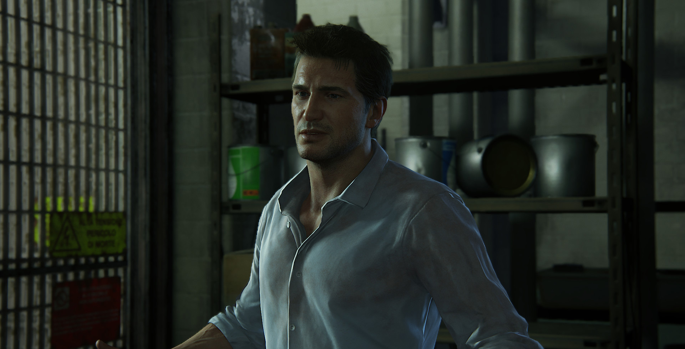

W każdej generacji konsol debiutuje tylko kilka gier, które pozostają z nami na dłużej – w trakcie rozmów, przewijając się w postaci niezliczonych wątków na forach, będąc częścią osobistych wspomnień, czy swoistych porównań, co do synonimu jakości. Jest też na ogół jedno studio deweloperskie, które za pomocą rozwiązań technicznych, sposobu prowadzenia historii, reżyserii, czy też dynamiki akcji definiuje kształt danej generacji, wyznacza nową erę w branży elektronicznej rozrywki. To studio, po kilku latach ciężkiej pracy, wciąga Was w przygodę, po której wszystko, w co do tej pory mieliście okazję zagrać wydaje się miałkie, pozbawione wyrazu, słabe.

Tak jak The Last of Us zdefiniowało siódmą generację konsol, tak i Uncharted 4: A Thief's End definiuje obecną – obie gry łączy jeden deweloper – studio Naughty Dog.

Ten niezwykle utalentowany zespół specjalistów z wszystkich możliwych dziedzin branży elektronicznej rozrywki za sprawą swojego ostatniego dziecka nie tyle puszcza oczko w kierunku innych deweloperów, dając tym samym do zrozumienia, jak powinna zostać wykonana współczesna gra – studio Naughty Dog bezczelnie śmieje się konkurencji w twarz, miażdżąc poziomem technicznym absolutnie wszystko, co do tej pory zostało wydane.

Oto Uncharted 4: A Thief's End – historia o miłości, rodzinie, niespełnionych dziecięcych marzeniach i poświęceniu. Historia naładowana tak ogromnym ładunkiem emocjonalnym, zaprezentowana w niezwykle czytelny... po prostu ludzki sposób. Opowieść, która powinna być przykładem tego, że gry akcji to nie tylko bezmyślne zabijanie tabunu przeciwników, ale i scenariusz, który poprzez poziom imersji potrafi wciągnąć gracza w wykreowany przez twórców świat, jak w bagno.

Ale tego nie da się osiągnąć, bez fenomenalnego poziomu narracji, bez świetnie wyreżyserowanych przerywników filmowych, bez bezbłędnej i wiarygodnej, a co najważniejsze emocjonalnej gry aktorskiej. Tego nie sa się osiągnąć bez odpowiedniego balansu, pomiędzy samym scenariuszem, a mechaniką rozgrywki. Bez wyczucia momentu, w którym należy historię pchnąć trochę do przodu, bez niczym nie skrępowanej naturalności.

Studio Naughty Dog opowiada nam historię Nathana Drake'a pracując nad serią Uncharted przeszło 12 lat. Przez ten czas, przez wszystkie kolejne gry serii, czy też projekty poboczne, autorzy szukali indywidualnego sposobu, w jaki historia powinna być połączona z dynamiką gier akcji. Gra The Last of Us była tego idealnym przykładem. Uncharted 4: A Thief's End podnosi poprzeczkę do poziomu, który ciężko będzie przeskoczyć.

Nolan North przez ostatnią dekadę prac nad serią Uncharted wykreował jedną z najbardziej rozpoznawalnych postaci w branży elektronicznej rozrywki. Wcielając się w postać Nathana Drake'a stworzył ikonę gier wideo – bohatera z krwi i kości, postać pełną charyzmy, postać lubianą i przede wszystkim ogromnie wiarygodną. Ogrom pracy, jaką włożył w przypadku Uncharted 4: A Thief's End w akompaniamencie z grą aktorską Troy'a Bakera (Samuel Drake), Emily Rose (Elena Fisher) oraz Richarda McGonagle (Victor Sullivan) daje nam kwartet bohaterów, którzy od pierwszych sekund gry wciągają w wykreowany przez Naughty Dog świat.

A ten po prostu powala... poziom oprawy wizualnej, jaką prezentują twórcy gry przez kilka kolejnych lat będzie zwyczajnie nieosiągalny dla innych, konkurencyjnych studiów deweloperskich. Uncharted 4: A Thief's End to gra dopracowana pod względem artystycznym w najdrobniejszych, często nawet pozornie zbędnych, szczegółach. Projekty lokacji, modele postaci, ich animacje oraz co najważniejsze mimika twarzy (ruch gałek ocznych, odwzorowanie mięśni twarzy/szyi, zmarszczek, przepuszczające światło końcówki małżowiny usznej), ruch włosów, fizyka obiektów, model zniszczeń, oświetlenie scen (!!!), czy też efekty cząsteczkowe – pod względem graficznym Uncharted 4: A Thief's End to wizualny orgazm i najładniejsza wydana do tej pory gra na konsolę PlayStation 4.

Rewelacyjny, główny motyw muzyczny z serii Uncharted sprawnie wspierany jest przez spejcalnie skomponowane na potrzeby tej części gry, nowe utwory muzyczne. Równie nastrojowe, równie idealnie pasujące do klimatu serii. Muzyka wzbogacona o naprawdę fenomenalne efekty dźwiękowe (deszcz, wichura, odgłosy wody, wybuchów, wystrzałów) z jasno określoną przestrzenią sprawnie podwyższa poziom i tak olbrzymiej już imersji.

W parze z oprawą wizualną oraz udźwiękowieniem idzie reżyseria samej gry – sceny przerywnikowe, odpowiednie ruchy kamery (również w przypadku samej gry), voice acting, naturalne emocje postaci, wyważona długość wstawek, czy świetna dynamika przedstawiająca sceny akcji, po których niejednokrotnie przechodzą dreszcze Ta gra jest widowiskowa od samego początku do samego końca – efektowna, nie efekciarska – jak bardzo dobry film.

Uncharted 4: A Thief's End wyłamuje się z kanonu niezwykle popularnego w dzisiejszych czasach w branży elektronicznej rozrywki – z głupiej mody wiecznie ciągnących się scenariuszy, pełnych fabularnych, jak i logicznych luk opowieści, które zawsze zostawiają furtkę na dziesiątki możliwych sequeli. Pod tym względem jest to jedna z perełek, która przedstawia graczom kompletną historię Nathana Drake'a. Historię, w której nie ma miejsca na kontynuację. Historię, z którą gracze przeżyli większą część siódmej generacji konsol i która pokazuje, ile jeszcze niespodzianek może nam zafundować aktualna, ósma już generacja.

Przez te wszystkie lata bawiłem się świetnie, wiedząc że mam przed sobą zwieńczenie opowieści łapałem się na tym, że robiłem wszystko, by specjalnie rozłożyć w czasie poznanie zakończenia. Dzięki Uncharted przeżyłem niesamowitą przygodę, Uncharted 4: A Thief's End zapewniła mi finał tej historii tak mocno napakowany emocjami, że patrząc na napisy końcowe przez kilka dłuższych chwil nie mogłem dojść do siebie, było mi zwyczajnie, tak po ludzku, kurewsko smutno. Że to koniec. Taka to była gra...

**SIC PARVIS MAGNA!**